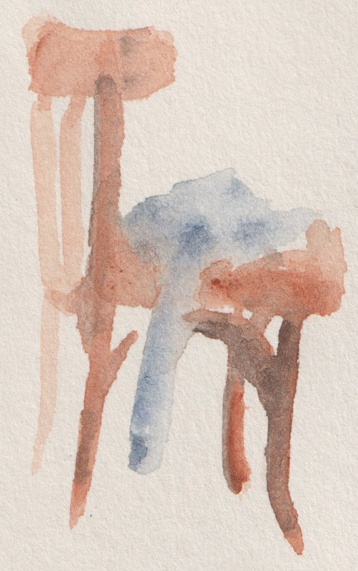

# Rachel's Handicrafts

A quirky, hand-drawn website for **Rachel's Handicrafts** — bespoke, local, ethical and sustainable
textiles, made by hand in Perth, WA on a Bernina 930 Record.

It's a plain static site (HTML/CSS/vanilla JS, no framework) hosted free on **GitHub Pages**. The
product catalogue is a JSON file you edit directly, the cart lives in the browser (`localStorage`),
and checkout generates a proper Order PDF that gets downloaded and handed to an email, ready to send.

The pages are generated from templates by a small Rust program (`cargo run`) so the header, nav and
footer live in **one** file instead of being copy-pasted into four and slowly drifting apart. The
generated HTML is never committed — CI builds and publishes it, so what's live always matches the
templates.

## Structure

```
templates/base.html  Shared shell: <head>, header/nav, footer. Edit the nav ONCE, here.
templates/index.html  Home page body (hero, "why it's different", featured products)
templates/shop.html    Full product grid
templates/cart.html    Cart: quantities, remove, subtotal
templates/checkout.html Customer details form → Order PDF → email handoff

src/main.rs          The build: renders templates/ + copies static files into dist/
Cargo.toml           Its one dependency (minijinja, a Jinja2-style template engine)
dist/                Generated output — gitignored, never edited by hand

css/style.css        All styling (hand-drawn/quirky theme, one file)
js/products.js        Loads data/products.json, renders product cards
js/cart.js            Cart logic (localStorage)
js/cart-page.js        Renders cart.html
js/checkout.js         Order building, PDF generation (jsPDF), mailto handoff
js/main.js             Shared bits: mobile nav, footer year

data/products.json     ← THE FILE YOU EDIT to add/change/remove products
data/config.json       Business name, email, tagline, etc.

assets/doodles/        Hand-drawn SVG illustrations (logo, sewing machine, icons)
assets/products/       Hand-drawn SVG placeholder art for each product
assets/art/            Rachel's own scanned sketches/watercolours, used as background decor
assets/art/paper_bg_*  The paper-grain background tile: _40 is the small one that carries the
                       first paint, _100 the full-res scan js/bg-swap.js upgrades to

art/                    Full-resolution originals of the scans (gitignored — see below)
```

## Editing the product list

Open `data/products.json` in any text editor. It's a plain JSON array — one object per product:

```json
{
  "id": "tote-bag",                  // unique, no spaces — used internally (cart, URLs)
  "sku": "RH-TOTE-01",
  "name": "Tote Bag",
  "price": 42,                       // number, no $ sign. Use null for "custom quote" items
  "currency": "AUD",
  "category": "Bags",
  "materials": "100% cotton canvas, cotton webbing straps",
  "description": "A sturdy everyday tote...",
  "image": "assets/products/tote-bag.svg",
  "images": [                        // optional — use instead of "image" for several photos
    "assets/products/tote-bag.svg",
    "assets/art/tote_bag.jpg"
  ],
  "madeOn": "Bernina 930 Record",
  "comingSoon": true,                // optional — parks the product: greyed-out "Coming soon!" instead of Add to Cart
  "swatches": [                      // optional — adds a fabric colour picker to the card
    { "name": "Natural Linen", "hex": "#e8ddc8" },
    { "name": "Gingham Blue",        // a swatch can show a fabric photo/pattern instead of a flat colour
      "image": "assets/swatches/gingham-blue.svg",
      "hex": "#8fb2c9",              // optional with an image — shown behind it while the image loads
      "materials": "Cotton/linen blend, hand-rolled hem" }   // optional — overrides the Materials line
  ]
}
```

To add a product: copy an existing block, give it a new `id`, and fill in the details. There's no
stock tracking — everything is made to order in small batches, so every product just stays listed.
Add a `swatches` array to offer a colour choice (shown as a compact, expandable fabric swatch
picker); leave it out for products that don't need one. Each swatch is drawn from either a `"hex"`
colour or an `"image"` (any `.svg`/`.jpg`/`.png` — keep them square, `assets/swatches/` is the
natural home for them); give both and the image is what shows, with the hex behind it as the
fallback. A swatch can also carry its own `"materials"` string for fabrics whose composition differs
from the product default — that line then replaces the card's Materials text whenever that fabric is
selected, the card gets a "varies by fabric" flag so shoppers know to check it, and the chosen
fabric's composition is carried through to the cart, the order PDF and the order email. Set `"comingSoon": true` on anything you're
still making but want listed — the card shows as normal (price, swatches and all) with a greyed-out
"Coming soon!" in place of the Add to Cart button, and it can't reach the cart or an order. Set
`"price": null` for something like a
custom/bespoke service — the card shows "Custom quote" and an "Enquire" button instead of a price
and Add to Cart. To swap in a real photo instead of the hand-drawn placeholder, just point `"image"`
at a `.jpg`/`.png` in `assets/products/` (any image works, square-ish photos look best). For several
photos of the same piece, use an `"images"` array instead — the card then gets ‹ › arrows to step
through them, a ⤢ button that opens the photo full-size in a dialog (arrow keys and Esc work there),
and a small "1 / 3" counter. The first photo in the list is the one used everywhere else (cart rows,
the order PDF), so lead with your best shot.

**After adding or replacing any `.jpg`/`.png`** (product photos, swatch images, the `assets/art/`
scans), regenerate its compressed `.webp` sibling — every page points images at the `.webp` first
and only falls back to the original if that file is missing:

```
magick path/to/photo.jpg -resize '1600x1600>' -quality 82 path/to/photo.webp
```

(`magick` is ImageMagick; `brew install imagemagick` / `apt install imagemagick` if you don't have
it.) Skipping this step isn't a hard failure — the site just quietly serves the uncompressed
original for that one photo until you run it — but images typically shrink 50–90%, so it's worth
doing before a batch of new product photos goes live. `.svg` icons and doodles don't need this;
only photographic `.jpg`/`.png` benefit from webp.

`data/config.json` holds the business-wide details — most importantly `"email"`, which is where the
checkout page addresses its email handoff. **Update that to your real inbox before you go live.**

## Running it locally

Build the site, then serve the `dist/` folder it produces:

```bash
cargo run
```

```bash
python3 -m http.server 8000 --directory dist
```

Then open `http://localhost:8000`. Re-run `cargo run` after editing anything in `templates/` — the
browser is serving `dist/`, so template edits don't show up until you rebuild. Editing `css/`, `js/`
or `data/` only needs a rebuild to copy the change across (it's incremental, so it's near-instant).

You need Rust for this — install it from [rustup.rs](https://rustup.rs) if `cargo` isn't found.

Serving through a local server rather than double-clicking a file matters because the product list
is loaded via `fetch()`, which browsers block on `file://` URLs. That restriction goes away once
deployed, since Pages serves over `https://`.

## How checkout → PDF → email works

This site has no backend or database, so there's no live payment processor and no server that can
send email on its own — it's an **order request** flow, not a checkout with card payments:

1. The customer fills in their details on `checkout.html` and submits.
2. The browser generates a branded **Order PDF** (via [jsPDF](https://github.com/parallax/jsPDF),
   loaded from a CDN) and downloads it as `order-<order-number>.pdf`.
3. It then shows a button that opens the customer's email client with a `mailto:` link — addressed
   to the business email from `config.json`, subject and body pre-filled with the order details.

The one limitation: **browsers can't attach files to a `mailto:` link** (there's no web API for it —
it's a long-standing security restriction). The confirmation screen tells the customer to attach the
PDF that just downloaded before hitting send. It's a two-click extra step, but it means the whole
site can stay static and free to host.

If down the track you want it fully automatic (PDF emailed with zero manual steps), that needs
*something* to actually own an SMTP connection or an email API — options, roughly easiest to hardest:

- **EmailJS** (or similar) — a client-side service that can send templated emails, including small
  attachments, straight from JavaScript. Free tier is limited but no server needed at all.
- **A tiny serverless function** (Netlify/Vercel/Cloudflare Functions) that receives the PDF and
  emails it via something like Resend, Postmark, or SendGrid. Still deploys alongside a static
  frontend, but it's no longer "just GitHub Pages."
- **Your own backend** with a real order database, payments (Stripe etc.), and email — a proper
  e-commerce build, well beyond a static site.

None of that is wired up here on purpose, to keep hosting free and dependency-free — but the order
data (`buildOrder()` in `js/checkout.js`) is already structured so it'd be easy to POST it somewhere
instead of just turning it into a PDF, if you outgrow the mailto approach later.

## The background artwork

The paper texture and the faint sketches sitting in the hero, section headers and footers
(`assets/art/*.jpg`) are Rachel's own scanned watercolours and pencil sketches — resized and
compressed for the web from the full-resolution originals in `/art/` (that source folder is
gitignored; it's just working material, not something the site loads).

Each one is dropped in with:

```html

```

`.art-decor` (in `css/style.css`) does the actual work: `mix-blend-mode: multiply` drops out each
scan's own paper tone (since it's close to the site's `--paper` colour), leaving just the ink or
watercolour marks, and a radial-gradient mask fades the rectangular edges to nothing — so it dissolves
into the page instead of sitting on top of it as a visible photo rectangle. The site's own background
(`assets/art/paper_bg_100.webp`) is a seamless tile cropped from a blank corner of one of the same
scans, so the page itself is made of the same paper the art is on.

That texture loads in two stages: the CSS starts on `paper_bg_40.webp` (~22KB) so the grain is there
at first paint, and `js/bg-swap.js` upgrades to the full-resolution `paper_bg_100.webp` (~445KB) once
it has downloaded, then records that in `localStorage`. On every later page load a small inline
script in the `<head>` reads that flag and applies the full-res version *before* first paint, so the
upgrade is only ever visible once — otherwise every navigation would visibly snap from blurry to
sharp. Anything that paints the texture must also set `background-color: var(--paper)`, or there is
nothing to paint until the image lands and it flashes white.

How fine the grain reads is `--paper-tile` in `:root` (currently `150px`) — smaller means more
repeats per screen and a denser, more detailed texture.

To add another piece: drop a resized/compressed image in `assets/art/`, add an `` where you want it, and give `.your-new-class` a `width`, a position (`top`/`left` or
`bottom`/`right`), and an `opacity` in the CSS. The parent element needs `position: relative` (and
usually `overflow: hidden`) for the absolute positioning to stay contained — `.hero`, `.site-footer`,
`.page-header` and `.confetti-band` already have this set up as examples. All `.art-decor` pieces
hide automatically under 700px width to keep things uncluttered on mobile.

## Deploying to GitHub Pages

Deployment runs through GitHub Actions (`.github/workflows/deploy.yml`): every push to `master`
builds the templates with Rust and publishes `dist/`.

**This requires one setting on GitHub:** **Settings → Pages → Build and deployment → Source** must
be set to **"GitHub Actions"** (not "Deploy from a branch"). The repo no longer contains any
committed `.html` at its root, so with the old branch-based setting Pages would find nothing to
serve and the site would 404.

After that, every `git push` redeploys automatically — watch it under the repo's **Actions** tab.
The custom domain keeps working because `CNAME` is copied into `dist/` as part of the build.

## Making a change later

This folder is already a git repository (`git log` to see history). The normal flow:

```bash
# edit data/products.json, templates/, or any file
git add -A
git commit -m "Add new scarf print to the shop"
git push
```

CI rebuilds and redeploys a minute or so after every push to `master`. You don't need to run
`cargo run` before committing — that's only for previewing locally, since `dist/` is never
committed and CI builds it fresh from the templates.

If you change `css/style.css`, also bump `CSS_V` in `src/main.rs` — it's the `?v=` cache-buster on
the stylesheet link, and without a bump returning visitors keep being served the copy they cached.
